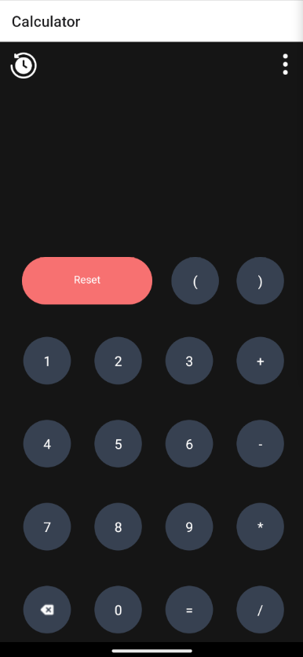
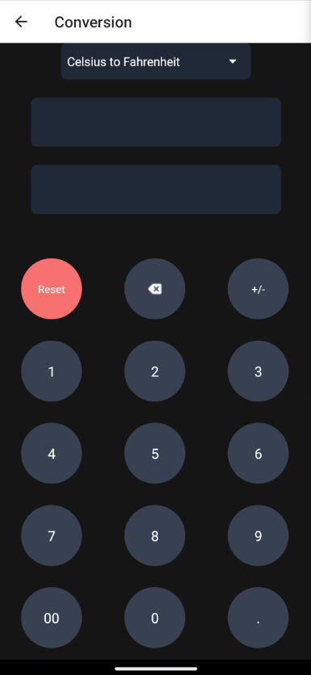

# Calculator App

[](https://wakatime.com/badge/user/19d677e9-0da9-4aa1-9d77-1b27177e095d/project/9b35fa10-674d-4a2e-bdb3-642cdb4bcfd1)

A simple, user-friendly calculator application built using **React Native**. This app supports basic arithmetic operations, conversions, and a variety of other useful features to help users perform quick calculations with ease

## Features

- Basic Arithmetic Operations: Addition, subtraction, multiplication, and division.
- Memory Function: Store and retrieve results.
- Additional Operations: Supports backspace, reset, and brace functions.
- Calculation History: View your recent calculations.
- Unit Conversions: Convert between various units like area, currency, length, power, speed, temperature, and weight.

## Conversions Supported
- Area
- Currency
- Length
- Power
- Speed
- Temperature
- Weight

## Technology Used

This app is developed using React Native with support for modern UI and gesture handling frameworks like NativeWind for styling.

## ScreenShots





## Installation

1. Clone the repository:
   ```bash
   git clone https://github.com/praveenraam/RN-Calculator.git
   cd calculator-app
   ```

2. Intall dependencies
   ```bash
   npm install
   ```

## Usage

The calculator is simple to use. It features a standard set of numeric buttons and operation keys. You can also perform conversions between different units by selecting the appropriate conversion mode.

## Contact
If you have any queries or want to connect, feel free to reach out through the following platforms:

- [Email](mailto:ckpraveeraam@gmail.com)
- [GitHub](https://github.com/praveenraam)
- [LinkedIn](https://linkedin.com/in/praveenraam)

## License

This project is licensed will be taken soon.